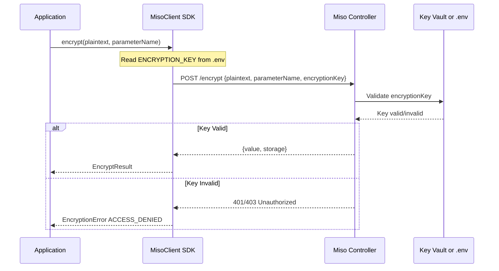

# Add ENCRYPTION_KEY Parameter to Encryption Service

## Problem Statement

The current server-side encryption implementation is missing the `encryptionKey` parameter. The controller requires this parameter to:

1. Validate that the caller has the correct encryption key for the environment
2. Provide two-level authorization (client credentials + encryption key)
3. Support different encryption keys per environment (production, testing, etc.)

## Security Architecture



**Two-Level Authorization:**

- Level 1: Client credentials (client ID + secret) - can be rotated by developers
- Level 2: Encryption key - controlled by administrators, protects sensitive data operations

## Files to Modify

### 1. Error Types - [miso_client/errors.py](miso_client/errors.py)

Add `ENCRYPTION_KEY_MISSING` to `EncryptionErrorCode`:

```python
EncryptionErrorCode = Literal[
    "ENCRYPTION_FAILED",
    "DECRYPTION_FAILED",
    "INVALID_PARAMETER_NAME",
    "ACCESS_DENIED",
    "PARAMETER_NOT_FOUND",
    "ENCRYPTION_KEY_MISSING",  # NEW
]
```

### 2. Config Model - [miso_client/models/config.py](miso_client/models/config.py)

Add `encryption_key` optional field to `MisoClientConfig`:

```python
encryption_key: Optional[str] = Field(
    default=None,
    description="Encryption key for encrypt/decrypt operations (per-environment)",
)
```

### 3. Config Loader - [miso_client/utils/config_loader.py](miso_client/utils/config_loader.py)

Add `ENCRYPTION_KEY` environment variable loading:

```python
encryption_key=os.getenv("ENCRYPTION_KEY"),
```

### 4. Encryption Service - [miso_client/services/encryption.py](miso_client/services/encryption.py)

**Constructor change:**

```python
def __init__(self, http_client: "HttpClient", config: "MisoClientConfig"):
    self.http_client = http_client
    self._encryption_key = config.encryption_key
```

**Add validation method:**

```python
def _validate_encryption_key(self) -> None:
    if not self._encryption_key:
        raise EncryptionError(
            "ENCRYPTION_KEY not configured. Set ENCRYPTION_KEY in .env file.",
            code="ENCRYPTION_KEY_MISSING",
        )
```

**Update encrypt() request body:**

```python
data={
    "plaintext": plaintext,
    "parameterName": parameter_name,
    "encryptionKey": self._encryption_key,
}
```

**Update decrypt() request body:**

```python
data={
    "value": value,
    "parameterName": parameter_name,
    "encryptionKey": self._encryption_key,
}
```

**Update error mapping (add 401):**

```python
if e.status_code in (401, 403):
    code = "ACCESS_DENIED"
```

### 5. MisoClient Init - [miso_client/client.py](miso_client/client.py)

Pass config to EncryptionService (line 62):

```python
self.encryption = EncryptionService(self.http_client, config)
```

### 6. Documentation - [docs/encryption.md](docs/encryption.md)

Add **Configuration** section at the top for SDK consumers:

**ENCRYPTION_KEY Requirement:**

- `ENCRYPTION_KEY` environment variable is **required** for encrypt/decrypt operations
- Must be set in your application's `.env` file
- The key is **environment-specific** (different for production, staging, testing)

**Where to Obtain the Key:**

- Contact your environment administrator or DevOps team
- The key may be stored in:
  - **Azure Key Vault** (production) - administrator retrieves from Key Vault
  - **Environment configuration** (development) - administrator provides directly
- Each environment has its own unique encryption key

**Security Model:**

- SDK reads `ENCRYPTION_KEY` from your `.env` file
- SDK sends `encryptionKey` parameter to miso-controller with each request
- Controller validates against its configured source (Key Vault or .env)
- Provides two-level authorization: client credentials alone are insufficient

**Example .env:**

```env
MISO_CONTROLLER_URL=https://controller.example.com
MISO_CLIENTID=your-client-id
MISO_CLIENTSECRET=your-client-secret
ENCRYPTION_KEY=obtain-from-your-environment-administrator
```

### 7. Tests - [tests/unit/test_encryption_service.py](tests/unit/test_encryption_service.py)

**Update fixture to include mock config:**

```python
@pytest.fixture
def mock_config(self):
    config = MagicMock()
    config.encryption_key = "test-encryption-key"
    return config

@pytest.fixture
def encryption_service(self, mock_http_client, mock_config):
    return EncryptionService(mock_http_client, mock_config)
```

**Add new test cases:**

- Test encryptionKey included in encrypt request body
- Test encryptionKey included in decrypt request body
- Test ENCRYPTION_KEY_MISSING error when config.encryption_key is None
- Test ACCESS_DENIED error mapping for 401 status
- Test ACCESS_DENIED error mapping for 403 status

## API Request Format

**Before:**

```json
{"plaintext": "secret-value", "parameterName": "my-param"}
```

**After:**

```json
{"plaintext": "secret-value", "parameterName": "my-param", "encryptionKey": "env-specific-key"}
```

## Error Handling

| Scenario | Error Code | HTTP Status |

|----------|------------|-------------|

| ENCRYPTION_KEY not set in .env | `ENCRYPTION_KEY_MISSING` | N/A (client-side) |

| Invalid encryption key | `ACCESS_DENIED` | 401 or 403 |

| Parameter not found | `PARAMETER_NOT_FOUND` | 404 |

| Encryption failed | `ENCRYPTION_FAILED` | 500 |

| Decryption failed | `DECRYPTION_FAILED` | 500 |