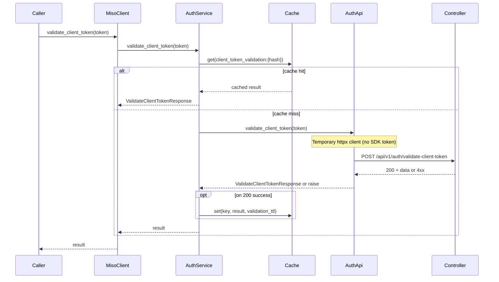

# Add validate-client-token public interface

## Context

- **Endpoint**: POST `/api/v1/auth/validate-client-token` (controller).
- **Purpose**: Validate a controller-issued application token (e.g. `x-client-token`). Used by dataplane and other services. **No authentication required** to call; the token in the request is what is validated.
- **Token input**: Either `x-client-token` header or body `{"token": "<value>"}`.
- **Important**: The SDK must **not** send its own client token when calling this endpoint. Use a one-off request (e.g. temporary `httpx.AsyncClient`) so the only token sent is the one being validated.
- **Caching**: Cache successful validation results (by token hash) to avoid extra controller calls; same pattern as user token validation (cache key, TTL, fallback on cache miss/failure).

## Rules and Standards

This plan follows [.cursorrules](.cursorrules) (project Cursor rules):

- **Architecture Patterns** – Service layer (AuthService), HTTP client (one-off request in AuthApi), token handling (no SDK client token on validate-client-token), Redis/cache pattern (check cache, then controller, cache on success).
- **Code Style** – Python conventions (snake_case, type hints, Google-style docstrings), error handling (MisoClientError with error_response, no uncaught raises from service).
- **Code Size Guidelines** – Files ≤500 lines, methods ≤20–30 lines; split if needed.
- **Testing Conventions** – pytest, pytest-asyncio, mock httpx/cache/API client, test success and error paths and cache hit/miss, 80%+ branch coverage for new code.
- **Security** – No client id/secret on this endpoint; token in request only; cache key from hash (no raw token in keys).

**Key requirements**: Use async/await and try/except for async ops; return typed responses; cache only when `data.authenticated` is True; use existing `parse_error_response` and `cache_validation_result`; add full docstrings and type hints for public methods.

## Before Development

- [ ] Read Architecture Patterns and Redis Caching Pattern in .cursorrules.
- [ ] Review [miso_client/services/auth_token_cache.py](miso_client/services/auth_token_cache.py) and [miso_client/utils/auth_cache_helpers.py](miso_client/utils/auth_cache_helpers.py) for cache key and TTL reuse.
- [ ] Review [miso_client/api/auth_api.py](miso_client/api/auth_api.py) and [miso_client/services/auth.py](miso_client/services/auth.py) for validate_token/cache flow.
- [ ] Ensure lint/format/test tooling runs (ruff, mypy, black, isort, pytest).

## Definition of Done

Before marking the plan complete:

1. **Lint**: Run `ruff check` and `mypy`; zero errors/warnings.
2. **Format**: Run `black` and `isort` on changed files.
3. **Test**: Run `pytest` after lint/format; all tests pass; ≥80% branch coverage for new code.
4. **Order**: LINT → FORMAT → TEST (do not skip).
5. **File size**: New/edited files ≤500 lines; methods ≤20–30 lines.
6. **Types and docstrings**: All new public functions have type hints and Google-style docstrings.
7. **Caching**: Client token validation result cached by token hash; cache hit avoids API call; 401/400 not cached.
8. **Exports**: If `ValidateClientTokenResponse` is part of the public API, export it from `miso_client/__init__.py`.
9. All tasks in this plan implemented and verified.

## 1. Response and request types

**File**: [miso_client/api/types/auth_types.py](miso_client/api/types/auth_types.py)

Add Pydantic models for the 200 response (camelCase, matching OpenAPI):

- `ValidateClientTokenResponse` with `data: ValidateClientTokenResponseData`.
- `ValidateClientTokenResponseData`: `authenticated: bool`, `application: Optional[ValidateClientTokenApplication]`, `environment: Optional[str]`, `applicationKey: Optional[str]`, `expiresAt: Optional[str]`.
- `ValidateClientTokenApplication`: `id: Optional[str]`, `key: Optional[str]`, `environmentId: Optional[str]`, `environmentKey: Optional[str]`.

All fields except `authenticated` optional to tolerate controller variations.

## 2. AuthApi: endpoint constant and method

**File**: [miso_client/api/auth_api.py](miso_client/api/auth_api.py)

- Add constant: `VALIDATE_CLIENT_TOKEN_ENDPOINT = "/api/v1/auth/validate-client-token"`.
- Add async method: `validate_client_token(self, token: str, *, send_as_header: bool = False) -> ValidateClientTokenResponse`.
  - **Request**: Use a **temporary** `httpx.AsyncClient` (no SDK client token). Base URL from `resolve_controller_url(self.http_client.config)`.
  - If `send_as_header`: send token only in header `x-client-token`. Otherwise send only in body `{"token": token}`.
  - **Errors**: On 4xx/5xx, use existing `parse_error_response` from [miso_client/utils/http_error_handler.py](miso_client/utils/http_error_handler.py) and raise `MisoClientError` with `status_code` and `error_response` (same pattern as [miso_client/utils/internal_http_client.py](miso_client/utils/internal_http_client.py) `_create_error_from_http_status`).
  - **Success**: Parse JSON and return `ValidateClientTokenResponse(**response.json())`.

Imports: `httpx`, `resolve_controller_url`, `parse_error_response`, `MisoClientError`, and the new response types.

## 3. Caching (avoid extra controller calls)

- **Cache key**: Use a dedicated namespace so client-token validation does not collide with user token validation. Add `get_client_token_validation_cache_key(token: str) -> str` in [miso_client/utils/auth_cache_helpers.py](miso_client/utils/auth_cache_helpers.py) returning `client_token_validation:{sha256(token)}` (same hashing approach as `get_token_cache_key`).
- **TTL**: Use existing `validation_ttl` from config (same as user token validation). Optionally derive from response `expiresAt` later; for now fixed TTL is sufficient.
- **Where to cache**: In **AuthService** only (not in AuthApi). AuthApi remains stateless; AuthService checks cache before calling API and caches successful result after API call.
- **Flow**: (1) AuthService receives `validate_client_token(token)`. (2) If `self.cache` is set, compute cache key and call `check_cache_for_token(self.cache, cache_key)` (reuse from [miso_client/services/auth_token_cache.py](miso_client/services/auth_token_cache.py)); if hit, return cached result as `ValidateClientTokenResponse`. (3) Call `api_client.auth.validate_client_token(...)`. (4) On success, call `cache_validation_result(self.cache, cache_key, response_dict, ttl)` (reuse existing helper; it only caches when `data.authenticated` is True). (5) Return response. Do not cache 400/401 responses.
- **Cache storage format**: Store the same dict returned by the API (`{"data": { "authenticated": true, "application": {...}, ... }}`) so parsing back to `ValidateClientTokenResponse` is trivial.

## 4. AuthService and MisoClient exposure

- **AuthService** ([miso_client/services/auth.py](miso_client/services/auth.py)): Add `async def validate_client_token(self, token: str, *, send_as_header: bool = False)` that (1) checks cache via `get_client_token_validation_cache_key` and `check_cache_for_token`; (2) on cache hit, returns `ValidateClientTokenResponse` built from cached dict; (3) on miss, calls `self.api_client.auth.validate_client_token(token, send_as_header=send_as_header)` and on success caches via `cache_validation_result` with `validation_ttl`; (4) returns the response. Delegate to API layer for the actual HTTP call; keep caching and error handling in the service.
- **MisoClient** ([miso_client/client.py](miso_client/client.py)): Add `async def validate_client_token(self, token: str, *, send_as_header: bool = False)` that calls `self.auth.validate_client_token(...)` and returns the response. Return type: `ValidateClientTokenResponse`.

## 5. Public exports

**File**: [miso_client/**init**.py](miso_client/__init__.py)

- Export the new response type(s) if they are part of the public API (e.g. `ValidateClientTokenResponse`), following the same pattern as `TokenExchangeResponse` / `ValidateTokenResponse` if those are exported.

## 6. Tests (comprehensive)

**AuthApi** ([tests/unit/test_auth_api.py](tests/unit/test_auth_api.py)):

- **Success (200)** – body token: Patch `httpx.AsyncClient` so the context manager yields a mock client whose `post` returns 200 and a JSON body matching `ValidateClientTokenResponse`. Call `auth_api.validate_client_token("token123")`. Assert `result.data.authenticated`, `result.data.application`, `result.data.expiresAt` (or other key fields). Assert the request was POST with body `{"token": "token123"}` and no `x-client-token` header (when `send_as_header=False`).
- **Success (200)** – header token: Same setup with `send_as_header=True`. Assert the request had header `x-client-token: token123` and no body (or empty body).
- **400 (token missing)**: Mock response status 400 and JSON error body. Assert `MisoClientError` is raised with `status_code=400` and optional `error_response` populated.
- **401 (invalid/expired token)**: Mock response status 401 and JSON error body. Assert `MisoClientError` is raised with `status_code=401`.

**AuthService / caching** (same file or [tests/unit/test_auth_service_caching.py](tests/unit/test_auth_service_caching.py) if it fits better):

- **Cache miss then cache set**: First call `auth_service.validate_client_token(token)` with mocked API returning 200; assert API was called once and result returned. Verify cache was written (mock `cache.set` called with correct key pattern `client_token_validation:...` and TTL).
- **Cache hit**: Prime cache (or mock `cache.get` to return a valid cached dict). Call `auth_service.validate_client_token(token)` twice; assert API was not called on second call and returned data matches cached content.
- **Cache failure / no cache**: With `cache=None` or `cache.get` returning None, assert API is called and result still returned (graceful fallback).
- **Do not cache 401**: When API returns 401, assert `cache.set` was not called (only successful validations are cached).

**Good test practices** (from project rules):

- Use pytest and `@pytest.mark.asyncio` for async tests. Mock httpx, cache, and API client. Aim for 80%+ branch coverage on new code. Test both success and error paths and cache hit/miss. Use `AsyncMock` for async methods. Follow existing fixture style (`auth_api`, `mock_http_client`, etc.).

## Architecture note

## Files to touch (summary)

| Area    | File                                          | Changes                                                                                          |
| ------- | --------------------------------------------- | ------------------------------------------------------------------------------------------------ |
| Types   | `miso_client/api/types/auth_types.py`          | Add ValidateClientToken* models                                                                  |
| Helpers | `miso_client/utils/auth_cache_helpers.py`     | Add get_client_token_validation_cache_key(token) → `client_token_validation:{sha256}`            |
| API     | `miso_client/api/auth_api.py`                 | VALIDATE_CLIENT_TOKEN_ENDPOINT, validate_client_token() with one-off httpx                        |
| Service | `miso_client/services/auth.py`                | validate_client_token() with cache check/store and delegation to api_client.auth                   |
| Client  | `miso_client/client.py`                       | validate_client_token() delegating to auth                                                        |
| Exports | `miso_client/__init__.py`                     | Export ValidateClientTokenResponse if desired                                                     |
| Tests   | `tests/unit/test_auth_api.py`                  | validate_client_token: 200 body, 200 header, 400, 401; AuthService cache hit/miss, no cache on 401 |

## Out of scope

- No change to FastAPI/Flask endpoint helpers (this is a **client** method to call the controller, not a server route).
- No audit-logging or special handling in HttpClient for this path; the one-off request in AuthApi avoids adding the SDK client token and keeps the contract “no auth required” for the caller.

---

## Plan Validation Report

**Date**: 2025-03-06  
**Plan**: .cursor/plans/37-validate_client_token_api.plan.md  
**Status**: VALIDATED

### Plan Purpose

Add a public interface to validate application (x-client-token) via POST `/api/v1/auth/validate-client-token`, with Redis/in-memory caching to avoid extra controller calls. Delivers Pydantic response types, AuthApi (one-off httpx request), AuthService with cache check/store, MisoClient exposure, and comprehensive tests. Type: Service Layer + HTTP Client + Testing.

### Applicable Rules

- **Architecture Patterns** – Service/API split, one-off request for unauthenticated validation, Redis/cache pattern (check cache then API then cache on success).
- **Code Style** – Type hints, Google-style docstrings, error handling (MisoClientError, no uncaught from service).
- **Code Size Guidelines** – Files under 500 lines, methods under 20–30 lines.
- **Testing Conventions** – pytest, pytest-asyncio, mock httpx/cache, success and error and cache hit/miss, 80%+ coverage for new code.
- **Security** – Cache key from token hash; no SDK client token sent to validate-client-token.

### Rule Compliance

- DoD requirements documented (lint, format, test order, coverage, file size, docstrings).
- Caching added: client-token validation cached in AuthService; key client_token_validation plus sha256; reuse check_cache_for_token and cache_validation_result; do not cache 4xx.
- Tests expanded: AuthApi 200 body/header, 400, 401; AuthService cache hit, cache miss and set, cache failure fallback, no cache on 401.

### Plan Updates Made

- Added Caching section (cache key helper, TTL, flow in AuthService, storage format).
- Updated AuthService to include cache check/store and delegation to API.
- Updated Files table with auth_cache_helpers and test scope.
- Added Rules and Standards and Before Development.
- Added Definition of Done (lint, format, test order, coverage, caching, exports).
- Expanded Tests to cover cache hit/miss, no cache on 401, and good test practices.
- Updated architecture diagram to include Cache and cache hit/miss flow.
- Appended this Plan Validation Report.

### Recommendations

- Implement get_client_token_validation_cache_key in auth_cache_helpers and use it only for client-token validation (do not reuse user token key).
- In tests, mock cache.get and cache.set to assert cache key pattern and that 401 responses are not cached.
- Run full test suite and coverage after implementation to confirm at least 80% on new code.

---

## Validation

**Date**: 2026-03-06  
**Status**: COMPLETE

### Executive Summary

Plan 37 (validate-client-token API) has been fully implemented. All required files exist, types and API/service/client methods are in place, caching uses a dedicated key and validation_ttl, and exports include `ValidateClientTokenResponse`. Unit tests cover AuthApi (200 body/header, 400, 401) and AuthService caching (cache miss/set, cache hit, no cache fallback, 401 not cached, cache key format). Format, lint, type-check, and full unit test suite pass.

### File Existence Validation

- **miso_client/api/types/auth_types.py** – Contains `ValidateClientTokenApplication`, `ValidateClientTokenResponseData`, `ValidateClientTokenResponse` (camelCase fields, optional except `authenticated`).
- **miso_client/utils/auth_cache_helpers.py** – Contains `get_client_token_validation_cache_key(token)` returning `client_token_validation:{sha256}`.
- **miso_client/api/auth_api.py** – Contains `VALIDATE_CLIENT_TOKEN_ENDPOINT` and `validate_client_token(token, *, send_as_header=False)` with one-off `httpx.AsyncClient`, `resolve_controller_url`, `parse_error_response`, `MisoClientError` on 4xx/5xx.
- **miso_client/services/auth.py** – Contains `validate_client_token` with cache check via `check_cache_for_token`, delegation to `api_client.auth.validate_client_token`, and `cache_validation_result` on success with `validation_ttl`.
- **miso_client/client.py** – Contains `validate_client_token` delegating to `self.auth.validate_client_token`, return type `ValidateClientTokenResponse`.
- **miso_client/__init__.py** – Exports `ValidateClientTokenResponse` (import and `__all__`).
- **tests/unit/test_auth_api.py** – Contains `test_validate_client_token_success_body`, `test_validate_client_token_success_header`, `test_validate_client_token_400`, `test_validate_client_token_401`.
- **tests/unit/test_auth_service_caching.py** – Contains class `TestAuthServiceValidateClientTokenCaching` with `test_validate_client_token_cache_miss_then_set`, `test_validate_client_token_cache_hit`, `test_validate_client_token_no_cache_fallback`, `test_validate_client_token_401_not_cached`, `test_client_token_validation_cache_key_format`.

### Test Coverage

- Unit tests exist for AuthApi (4 tests) and AuthService/caching (5 tests). Tests use pytest, `@pytest.mark.asyncio`, `AsyncMock`, and patch `httpx.AsyncClient` or mock `api_client`/`cache`. Success, 400, 401, cache hit, cache miss, no cache, and 401-not-cached cases covered.
- No integration tests required by plan.

### Code Quality Validation

- **STEP 1 – FORMAT**: PASSED (black and isort check).
- **STEP 2 – LINT**: PASSED (ruff check, 0 errors, 0 warnings).
- **STEP 3 – TYPE CHECK**: PASSED (mypy miso_client, no issues).
- **STEP 4 – TEST**: PASSED (pytest tests/unit/, 1337 passed).

### Cursor Rules Compliance

- Code reuse: Uses `parse_error_response`, `cache_validation_result`, `check_cache_for_token`, `resolve_controller_url`; no duplication.
- Error handling: AuthApi raises `MisoClientError` with `error_response`; AuthService raises `ValueError` when `api_client` missing; 401 not cached.
- Logging: No new logging; existing cache/error patterns respected.
- Type safety: Pydantic models and type hints on all new public methods.
- Async patterns: All new methods async/await.
- HTTP client: One-off `httpx.AsyncClient` for validate-client-token (no SDK client token sent).
- Token management: Token only in request (header or body); cache key from SHA-256 hash.
- Caching: Cache in AuthService only; key `client_token_validation:{hash}`; TTL from `validation_ttl`; fallback when cache None.
- Service layer: AuthService uses `api_client.auth`, config via `http_client.config`.
- Security: No client id/secret; cache key hashed.
- API data: Response types use camelCase (OpenAPI).
- File size: Touched files under 500 lines; new methods under 30 lines.

### Implementation Completeness

- Services: AuthService.validate_client_token implemented with cache and delegation.
- Models: ValidateClientToken* types in auth_types.py.
- Utilities: get_client_token_validation_cache_key in auth_cache_helpers.py.
- Documentation: README, docs/backend-client-token.md, and CHANGELOG updated for validate_client_token.
- Exports: ValidateClientTokenResponse exported from miso_client/__init__.py.

### Issues and Recommendations

- None. Export of `ValidateClientTokenResponse` was re-added in __init__.py during validation to match plan.

### Final Validation Checklist

- [x] All implementation tasks (sections 1–6) completed
- [x] All files exist and contain expected changes
- [x] Tests exist and pass (9 plan-related tests, full suite 1337)
- [x] Code quality (format, lint, type-check, test) passes
- [x] Cursor rules compliance verified
- [x] Implementation complete (types, API, service, client, cache helper, exports, docs)

**Result**: **VALIDATION PASSED** – Plan 37 (validate-client-token API) is fully implemented and verified.

