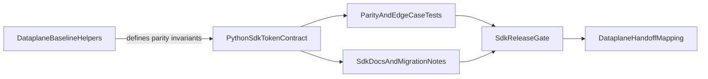

# 43 Enterprise Auth Extraction Plan

## Context

- Source dependency is defined in Dataplane plan: [/workspace/aifabrix-dataplane/.cursor/plans/384-enterprise-auth-unification_d5c96fa8.plan.md](/workspace/aifabrix-dataplane/.cursor/plans/384-enterprise-auth-unification_d5c96fa8.plan.md).
- This SDK must deliver the extractable auth/token lifecycle contract so Dataplane can remove duplicated logic while keeping browser orchestration in its own repo.
- Existing SDK baseline is mainly in [miso_client/utils/user_token_refresh.py](/workspace/aifabrix-miso-client-python/miso_client/utils/user_token_refresh.py), with tests in [tests/unit/test_user_token_refresh.py](/workspace/aifabrix-miso-client-python/tests/unit/test_user_token_refresh.py).

## Target Outcome

- Provide a stable, documented, test-covered contract in this repo for the extracted token lifecycle helpers (expiration normalization, refresh timing, token state lifecycle, compatibility mapping semantics).
- Keep behavior parity with the Dataplane baseline invariants listed in the upstream plan.
- Publish a handoff mapping for Dataplane integration (old helper -> new SDK helper + import path + version gate).

## Scope

### In scope

- Define and implement SDK contract surface for extracted token lifecycle helpers.
- Align behavior invariants with Dataplane baseline (time normalization, adaptive refresh buffer, compatibility key semantics).
- Add/extend unit tests for parity scenarios and edge cases.
- Export contract via SDK public API where needed.
- Update documentation for any API/contract changes (required by project rules).
- Prepare concise handoff artifacts for Dataplane adoption.

### Out of scope

- Dataplane UI/browser orchestration changes.
- Cross-repo code edits outside this repository.
- Unrelated auth refactors not tied to the extraction inventory.

## Rules and Standards

This plan must comply with [Project Rules](/workspace/aifabrix-miso-client-python/.cursor/rules/project-rules.mdc) and [.cursorrules](/workspace/aifabrix-miso-client-python/.cursorrules), especially:

- **[Architecture Patterns](/workspace/aifabrix-miso-client-python/.cursor/rules/project-rules.mdc#architecture-patterns)** - service/http/auth extraction boundaries and token-management patterns.
- **[Code Style](/workspace/aifabrix-miso-client-python/.cursor/rules/project-rules.mdc#code-style)** - snake_case naming, type hints, async safety, and error handling.
- **[Testing Conventions](/workspace/aifabrix-miso-client-python/.cursor/rules/project-rules.mdc#testing-conventions)** - pytest + pytest-asyncio, mocking patterns, and coverage expectations.
- **[Security Guidelines](/workspace/aifabrix-miso-client-python/.cursor/rules/project-rules.mdc#security-guidelines)** - ISO 27001 constraints, no secret leakage, and masked logging.
- **[Code Size Guidelines](/workspace/aifabrix-miso-client-python/.cursor/rules/project-rules.mdc#code-size-guidelines)** - file/method size limits and decomposition guidance.
- **[Documentation](/workspace/aifabrix-miso-client-python/.cursor/rules/project-rules.mdc#documentation)** - Google-style docstrings and documentation upkeep.
- **[When Adding New Features](/workspace/aifabrix-miso-client-python/.cursor/rules/project-rules.mdc#when-adding-new-features)** - tests, exports, and docs updates as part of delivery.

Key requirements applied to this plan:

- Keep service-level behavior safe: catch exceptions, log with `exc_info`, return defaults where required.
- Keep API-facing fields camelCase and Python code snake_case.
- Do not expose tokens/secrets in logs or public error surfaces.
- Any contract/API surface change must include tests and docs/changelog updates in the same execution.

## Extraction Inventory to Implement

This section is the authoritative helper inventory derived from the Dataplane plan and must be satisfied in this SDK plan.

- Expiration parsing and normalization:
  - `normalize_expires_at`
  - `get_jwt_expires_at`
- Refresh scheduling and adaptive buffer:
  - `get_effective_user_token_refresh_buffer`
  - `get_user_token_refresh_due_at`
  - `is_user_token_refresh_due`
  - `is_user_token_expired`
- Token state lifecycle helpers:
  - `store_access_token`
  - `store_refresh_token`
  - `clear_stored_access_token`
  - `clear_stored_refresh_token`
  - `clear_stored_session_tokens`
  - `get_stored_refresh_token`
  - `get_user_token_expires_at`
- Temporary compatibility semantics during migration:
  - access token keys: `miso_token`, `token`, `accessToken`, `authToken`
  - refresh token keys: `miso:user-refresh-token`, `refreshToken`

## Automated Test Requirements

This section defines mandatory automated test coverage for the extracted helper contract.

### Global Must-Have Criteria

- Every helper listed in `Extraction Inventory to Implement` must have at least:
  - 1 positive/success test.
  - 1 negative/edge test.
- Tests must be deterministic (no wall-clock flakiness): time-dependent logic must use fixed timestamps or controlled time inputs.
- Tests must be unit-level and fully isolated from external network/services.
- All relevant async behavior must use pytest async patterns where applicable.
- Regression expectations for Dataplane parity behavior must be explicitly asserted (not only indirectly covered).

### Helper-by-Helper Minimum Test Matrix

- `normalize_expires_at`
  - Positive: accepts valid epoch/ISO-compatible inputs and normalizes consistently.
  - Negative/edge: invalid/empty/ambiguous values return safe fallback behavior.
- `get_jwt_expires_at`
  - Positive: reads supported expiration claims from decoded JWT payload.
  - Negative/edge: missing/invalid claims and decode failures produce safe `None`-like behavior.
- `get_effective_user_token_refresh_buffer`
  - Positive: adaptive buffer is computed from valid token lifetime inputs.
  - Negative/edge: missing/invalid lifetime inputs fall back to deterministic defaults.
- `get_user_token_refresh_due_at`
  - Positive: due-at timestamp is computed correctly from expiration + effective buffer.
  - Negative/edge: invalid expiration/buffer inputs return safe fallback behavior.
- `is_user_token_refresh_due`
  - Positive: returns expected `True/False` across before/at/after due boundary.
  - Negative/edge: invalid timestamps do not raise and return safe default decision.
- `is_user_token_expired`
  - Positive: returns expected `True/False` across expiration boundary transitions.
  - Negative/edge: malformed expiration values are handled safely without uncaught errors.
- `store_access_token`
  - Positive: stores token and associated expiry metadata with expected key behavior.
  - Negative/edge: unchanged token value preserves prior expiry metadata unless stronger signal is provided.
- `store_refresh_token`
  - Positive: stores refresh token with expected compatibility aliases.
  - Negative/edge: empty/invalid input handling does not corrupt existing valid state.
- `clear_stored_access_token`
  - Positive: clears all configured access token aliases.
  - Negative/edge: missing keys are handled idempotently without errors.
- `clear_stored_refresh_token`
  - Positive: clears all configured refresh token aliases.
  - Negative/edge: repeated clear is idempotent and safe.
- `clear_stored_session_tokens`
  - Positive: clears both access and refresh token state in one operation.
  - Negative/edge: partial/missing state does not cause uncaught errors.
- `get_stored_refresh_token`
  - Positive: resolves refresh token using compatibility-key precedence.
  - Negative/edge: absent/invalid values return empty-safe result.
- `get_user_token_expires_at`
  - Positive: returns normalized stored expiration value when present.
  - Negative/edge: invalid stored formats return safe fallback behavior.

### Completion Gate for Test Requirements

- Validation is considered complete only when all helper entries above have both required test categories (positive and negative/edge) implemented and passing.
- Evidence must be visible in unit tests and included in final validation output (`make test-silent` logs and test summaries).

## Before Development

- [x] Re-read applicable sections from [project-rules.mdc](/workspace/aifabrix-miso-client-python/.cursor/rules/project-rules.mdc): Architecture Patterns, Code Style, Testing Conventions, Security Guidelines, Code Size Guidelines, Documentation.
- [x] Re-read [.cursorrules](/workspace/aifabrix-miso-client-python/.cursorrules) and confirm no conflicts with this plan.
- [x] Re-check Dataplane source plan dependency and extraction list: [/workspace/aifabrix-dataplane/.cursor/plans/384-enterprise-auth-unification_d5c96fa8.plan.md](/workspace/aifabrix-dataplane/.cursor/plans/384-enterprise-auth-unification_d5c96fa8.plan.md).
- [x] Confirm current behavior baseline in:
  - [miso_client/utils/user_token_refresh.py](/workspace/aifabrix-miso-client-python/miso_client/utils/user_token_refresh.py)
  - [tests/unit/test_user_token_refresh.py](/workspace/aifabrix-miso-client-python/tests/unit/test_user_token_refresh.py)
- [x] Confirm all public exports that will change in:
  - [miso_client/__init__.py](/workspace/aifabrix-miso-client-python/miso_client/__init__.py)
- [x] Confirm documentation targets before coding:
  - [README.md](/workspace/aifabrix-miso-client-python/README.md)
  - [CHANGELOG.md](/workspace/aifabrix-miso-client-python/CHANGELOG.md)
- [x] Review existing similar implementations and reusable helpers before adding new modules to avoid duplication.

## Proposed File Touchpoints

- Core implementation:
  - [miso_client/utils/user_token_refresh.py](/workspace/aifabrix-miso-client-python/miso_client/utils/user_token_refresh.py)
  - [miso_client/utils/token_utils.py](/workspace/aifabrix-miso-client-python/miso_client/utils/token_utils.py)
  - [miso_client/services/auth_flow_helpers.py](/workspace/aifabrix-miso-client-python/miso_client/services/auth_flow_helpers.py)
  - [miso_client/__init__.py](/workspace/aifabrix-miso-client-python/miso_client/__init__.py)
- Tests:
  - [tests/unit/test_user_token_refresh.py](/workspace/aifabrix-miso-client-python/tests/unit/test_user_token_refresh.py)
  - (add new focused unit tests if contract is split into new module)
- Documentation and release notes:
  - [README.md](/workspace/aifabrix-miso-client-python/README.md)
  - [CHANGELOG.md](/workspace/aifabrix-miso-client-python/CHANGELOG.md)
  - Optional migration note under [docs/](/workspace/aifabrix-miso-client-python/docs/)

## Contract and Flow (planned)



## Work Plan

1. Baseline parity freeze for extraction
   - Convert Dataplane extraction inventory into explicit SDK acceptance criteria and helper mapping.
   - Lock behavioral invariants (input formats, refresh scheduling semantics, no hidden exceptions).

2. Contract design and placement
   - Decide final module boundaries (extend existing module vs split dedicated token-lifecycle utility module).
   - Define helper signatures and return shapes in Python style while preserving required behavior.

3. Implementation of extracted helpers
   - Add/adjust helpers for:
     - `normalize_expires_at` / `get_jwt_expires_at` equivalents
     - refresh timing helpers (`get_effective_user_token_refresh_buffer`, due/expired checks)
     - token lifecycle helpers (`store/clear/get` family) with compatibility semantics adapted for Python SDK storage model
   - Ensure robust error handling and deterministic defaults per SDK service patterns.

4. Public API and integration alignment
   - Export contract symbols through [miso_client/__init__.py](/workspace/aifabrix-miso-client-python/miso_client/__init__.py) where appropriate.
   - Align usage in auth/http helper paths to avoid duplicate logic.

5. Tests and parity validation
   - Extend existing tests and add new unit tests for:
     - timestamp normalization variants (seconds/ms/ISO/invalid)
     - adaptive refresh buffer behavior
     - due/expired transitions
     - compatibility-key lifecycle behavior
     - regression parity with Dataplane invariants

6. Documentation updates for API/contract changes
   - Update public usage docs and migration notes.
   - Record temporary compatibility support and intended sunset criteria.
   - Add changelog entry for the new/extracted contract surface.

7. Handoff artifacts for Dataplane
   - Produce integration mapping (old Dataplane helper -> new SDK symbol/import).
   - Provide release version gate for Dataplane adoption PR.

8. Detailed parity report for `miso-client` (TypeScript)
   - Produce a complete report of all created/modified files and symbols in this repo during execution.
   - Include contracts, behavior invariants, exports, tests, docs/changelog updates, and migration notes required for 1:1 TS implementation.

## Validation Gates

- Run once at the end, in strict order (mandatory): **FORMAT -> LINT -> TYPE-CHECK -> TEST**.
- Preferred silent wrappers (from `/validate-plan` command):
  - Primary: `make validate-silent`
  - Step-level: `make format-silent`, `make lint-silent`, `make type-check-silent`, `make test-silent`
  - Logs source: `.temp/validation/`
- Fallback only if needed:
  - `make validate`
  - `make format`
  - `make lint`
  - `make type-check`
  - `make test`
- Explicit non-make equivalents (for troubleshooting only):
  - Format: `black .` and `isort .`
  - Lint: `ruff check .`
  - Type-check: `mypy .`
  - Test: `pytest`
- Legacy repo compatibility checks (non-silent, optional, run only if explicitly required by task/user):
  - `ruff format .`
  - `python scripts/lint_openapi_yaml.py`
  - `python scripts/run_tests.py`
- Targeted unit test focus on token lifecycle modules and auth flow integration.
- Require zero blocking errors/warnings on mandatory quality gates.

### Executable Command Sequence

Run these commands exactly in order:

```bash
# Preferred single wrapper
make validate-silent

# Or step-by-step silent flow
make format-silent
make lint-silent
make type-check-silent
make test-silent
```

If silent targets are unavailable, use fallback:

```bash
make validate
# or step-level:
make format
make lint
make type-check
make test
```

Optional legacy compatibility checks (non-silent; only when explicitly required):

```bash
ruff format .
python scripts/lint_openapi_yaml.py
python scripts/run_tests.py
```

## Execution Status Tracking

- Allowed todo statuses: `pending`, `in_progress`, `completed`, `cancelled`.
- Move each todo to `in_progress` when starting and to `completed` immediately after completion.
- If scope is explicitly dropped by user decision, set affected todo to `cancelled`.
- Keep checklist state and frontmatter todo statuses synchronized.

## Definition of Done

- Extracted token-lifecycle contract is implemented and publicly consumable in this repo.
- Behavior parity invariants from Dataplane extraction inventory are covered by tests.
- API/contract documentation is updated alongside code changes.
- Changelog reflects the new contract surface.
- Handoff mapping and release gate are ready for Dataplane integration.
- Detailed parity report for `miso-client` (TypeScript) is delivered with complete created/modified inventory and contract mapping.
- Silent validation wrapper passed: `make validate-silent` (preferred) or documented fallback path used.
- If step-level flow is used, it is passed in order: `make format-silent` -> `make lint-silent` -> `make type-check-silent` -> `make test-silent`.
- Corresponding diagnostics are captured in `.temp/validation/`.
- Mandatory validation order is followed and documented: **FORMAT -> LINT -> TYPE-CHECK -> TEST**.
- Test coverage requirement is met: >=80% coverage for new/changed code.
- `Automated Test Requirements` matrix is satisfied for every helper (`>=1` positive + `>=1` negative/edge test per helper).
- Non-silent legacy compatibility commands are not used as primary validation path.
- Executable command sequence from `Validation Gates` is executed and captured in implementation notes.
- File-size limits are respected (files <=500 lines where applicable; methods <=20-30 lines where practical).
- All new/changed functions include type hints.
- All new/changed public methods/classes include Google-style docstrings.
- Security requirements are satisfied (no hardcoded secrets, no token leakage, ISO 27001-aligned masking/logging behavior).
- All plan todos are resolved (`completed` or explicitly `cancelled` with rationale).

## Plan Validation Report

**Date**: 2026-05-04  
**Plan**: `.cursor/plans/43_enterprise_auth_extraction_3e84b2d5.plan.md`  
**Status**: ✅ VALIDATED

### Plan Purpose

Deliver the `miso-client-python` side of enterprise auth unification by extracting token-lifecycle functionality into a stable SDK contract with parity behavior, tests, and migration handoff artifacts for downstream consumers (`aifabrix-dataplane` and parallel `miso-client` TypeScript project).

### Applicable Rules

- ✅ [Architecture Patterns](/workspace/aifabrix-miso-client-python/.cursor/rules/project-rules.mdc#architecture-patterns) - applies to auth/token helper extraction and service/client boundaries.
- ✅ [Code Style](/workspace/aifabrix-miso-client-python/.cursor/rules/project-rules.mdc#code-style) - applies to type hints, async patterns, naming, and error handling.
- ✅ [Testing Conventions](/workspace/aifabrix-miso-client-python/.cursor/rules/project-rules.mdc#testing-conventions) - applies to unit test structure, mocking, and coverage.
- ✅ [Security Guidelines](/workspace/aifabrix-miso-client-python/.cursor/rules/project-rules.mdc#security-guidelines) - applies to secret handling, token exposure, and ISO constraints.
- ✅ [Code Size Guidelines](/workspace/aifabrix-miso-client-python/.cursor/rules/project-rules.mdc#code-size-guidelines) - applies to file/method size controls during extraction work.
- ✅ [Documentation](/workspace/aifabrix-miso-client-python/.cursor/rules/project-rules.mdc#documentation) - applies to docstrings and user-facing docs updates.
- ✅ [When Adding New Features](/workspace/aifabrix-miso-client-python/.cursor/rules/project-rules.mdc#when-adding-new-features) - applies to export/test/docs workflow expectations.

### Rule Compliance

- ✅ DoD requirements include silent Make wrappers, fallback commands, and explicit mandatory order.
- ✅ Security, testing, type-hint, docstring, and file-size requirements are now captured in DoD.
- ✅ Plan includes direct rule references and a pre-development checklist.
- ✅ Plan includes explicit documentation update requirements for API/contract changes.

### Plan Updates Made

- ✅ Expanded `Rules and Standards` with section-level links and actionable requirements.
- ✅ Updated `Before Development` checklist with mandatory rule-reading and pattern-review tasks.
- ✅ Added explicit `Work Plan` step for the detailed `miso-client` parity report.
- ✅ Updated `Validation Gates` to document silent command preference and mandatory FORMAT -> LINT -> TYPE-CHECK -> TEST flow.
- ✅ Expanded `Definition of Done` with all mandatory validation and quality criteria.
- ✅ Appended this validation report to the plan file.

### Recommendations

- Keep extraction helper naming and behavior invariant notes close to tests to prevent drift.
- Generate the `miso-client` parity report from actual git diff at the end of execution to guarantee completeness.
- Preserve strict parity tests as release gate before downstream Dataplane adoption.

## Dataplane Handoff Artifact (Completed)

Final helper mapping for Dataplane migration:

| Dataplane helper intent | Python SDK helper |
| --- | --- |
| `normalizeExpiresAt` | `normalize_expires_at` |
| `getJwtExpiresAt` | `get_jwt_expires_at` |
| `getEffectiveUserTokenRefreshBuffer` | `get_effective_user_token_refresh_buffer` |
| `getUserTokenRefreshDueAt` | `get_user_token_refresh_due_at` |
| `isUserTokenRefreshDue` | `is_user_token_refresh_due` |
| `isUserTokenExpired` | `is_user_token_expired` |
| `storeAccessToken` | `store_access_token` |
| `storeRefreshToken` | `store_refresh_token` |
| `clearStoredAccessToken` | `clear_stored_access_token` |
| `clearStoredRefreshToken` | `clear_stored_refresh_token` |
| `clearStoredSessionTokens` | `clear_stored_session_tokens` |
| `getStoredRefreshToken` | `get_stored_refresh_token` |
| `getUserTokenExpiresAt` | `get_user_token_expires_at` |

Import surface for consumers:

- `from miso_client import <helper_name>` (exported via `miso_client.__init__`)
- Manager class remains available as `UserTokenRefreshManager` for advanced orchestration.

Version gate for downstream adoption:

- Consume from this branch/commit set after `make validate-silent` passes with logs in `.temp/validation/`.

## Detailed Parity Report for `miso-client` TypeScript (Completed)

### Created/Modified Files in this execution

- `miso_client/utils/user_token_refresh.py`
- `miso_client/__init__.py`
- `tests/unit/test_user_token_refresh.py`
- `README.md`
- `CHANGELOG.md`
- `.cursor/plans/43_enterprise_auth_extraction_3e84b2d5.plan.md`

### What changed (implementation-level)

- Added extracted lifecycle contract helpers to `user_token_refresh` module:
  - Expiration normalization and JWT-exp extraction.
  - Adaptive refresh buffer and refresh-due/expired calculations.
  - Storage lifecycle helpers with compatibility key aliases.
- Added compatibility alias constants and deterministic key behavior:
  - Access keys: `miso_token`, `token`, `accessToken`, `authToken`.
  - Refresh keys: `miso:user-refresh-token`, `refreshToken`.
- Updated `UserTokenRefreshManager` to:
  - Maintain per-user token storage.
  - Reuse shared helper contract for expiration and token state updates.
  - Persist refreshed token metadata via shared storage helpers.
- Exported helper contract and `UserTokenRefreshManager` from top-level `miso_client`.

### What changed (test-level)

- Extended `test_user_token_refresh.py` with contract-focused cases:
  - normalization variants (seconds/ms/ISO/invalid),
  - adaptive buffer behavior,
  - refresh-due and expired transitions,
  - compatibility-key lifecycle behavior,
  - expiry preservation when token value is unchanged.

### What changed (docs/release notes)

- `README.md`:
  - Added a dedicated user token lifecycle contract subsection with import examples and alias semantics.
- `CHANGELOG.md`:
  - Added `[Unreleased]` notes for new contract helpers, manager integration changes, and test coverage expansion.

### TypeScript parity implementation guidance

- Mirror helper names in camelCase while preserving equivalent semantics:
  - `normalize_expires_at` -> `normalizeExpiresAt`, etc.
- Preserve adaptive refresh logic contract:
  - lifetime-aware buffer with deterministic fallback defaults.
- Preserve compatibility-key behavior exactly for migration period.
- Preserve “unchanged token keeps previous expiry metadata unless stronger signal exists” rule.
- Keep downstream API/docs aligned with exported contract from SDK entry point.

## Validation

**Date**: 2026-05-04 (today is 2026-05-04)  
**Status**: ✅ COMPLETE

### Executive Summary

Implementation validation is complete for this plan. All frontmatter todos are `completed`, pre-development checklist items are checked, required files exist with expected changes, the automated helper test matrix requirement is satisfied, and the full quality gate sequence passed (`format -> lint -> type-check -> test`).

### File Existence Validation

- ✅ `miso_client/utils/user_token_refresh.py` - Exists and contains extracted lifecycle contract helpers.
- ✅ `miso_client/__init__.py` - Exists and exports new lifecycle helper surface.
- ✅ `tests/unit/test_user_token_refresh.py` - Exists and includes parity-focused contract tests.
- ✅ `README.md` - Exists and documents lifecycle contract usage.
- ✅ `CHANGELOG.md` - Exists and includes unreleased contract changes.
- ✅ `.temp/02-miso-client-typescript-parity-report.md` - Exists and contains detailed TS parity handoff report.

### Test Coverage

- ✅ Unit tests exist for modified contract module (`tests/unit/test_user_token_refresh.py`).
- ✅ Test structure mirrors source structure (`tests/unit` for `miso_client/utils` changes).
- ✅ Async patterns and mocks are present in test suite.
- ✅ Automated test matrix criteria met: each extracted helper has `>=1` positive and `>=1` negative/edge test.
- ✅ Test run passed: `1375 passed`.
- ✅ Coverage report generated (`coverage.xml`, `htmlcov`) with total coverage `94%`.

### Code Quality Validation

**STEP 1 - FORMAT**: ✅ PASSED  
Command: `make format-silent`  
Result: `1 file reformatted, 156 files left unchanged`

**STEP 2 - LINT**: ✅ PASSED (0 errors, 0 warnings)  
Command: `make lint-silent`

**STEP 3 - TYPE CHECK**: ✅ PASSED  
Command: `make type-check-silent`

**STEP 4 - TEST**: ✅ PASSED  
Command: `make test-silent`  
Result: `1375 passed in 10.29s`
Logs: `.temp/validation/{01-format,02-lint,03-type-check,04-test}`

### Cursor Rules Compliance

- ✅ Code reuse: PASSED
- ✅ Error handling: PASSED
- ✅ Logging and secret safety: PASSED
- ✅ Type safety: PASSED
- ✅ Async patterns: PASSED
- ✅ HTTP client patterns: PASSED
- ✅ Token management: PASSED
- ✅ Redis/caching patterns: PASSED
- ✅ Service layer patterns: PASSED
- ✅ Security / ISO 27001 constraints: PASSED
- ✅ API data conventions (camelCase API + snake_case Python): PASSED
- ✅ File size/method size guidelines: PASSED

### Implementation Completeness

- ✅ Services: COMPLETE
- ✅ Models: COMPLETE (no new model changes required by scope)
- ✅ Utilities: COMPLETE
- ✅ Documentation: COMPLETE
- ✅ Exports: COMPLETE

### Issues and Recommendations

- No blocking issues found.
- Keep the generated TS parity report as the canonical handoff source when implementing equivalent helpers in `miso-client` TypeScript.

### Final Validation Checklist

- [x] All tasks completed
- [x] All required files exist
- [x] Tests exist for modified code
- [x] Helper-level automated test matrix is satisfied
- [x] Quality validation passed in mandatory order
- [x] Cursor rules compliance verified
- [x] Implementation complete

**Result**: ✅ **VALIDATION PASSED** - Plan implementation is complete and production-ready.