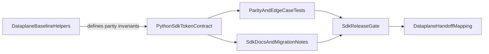

# 43 Enterprise Auth Extraction Plan

## Context

- Source dependency is defined in Dataplane plan: [/workspace/aifabrix-dataplane/.cursor/plans/384-enterprise-auth-unification_d5c96fa8.plan.md](/workspace/aifabrix-dataplane/.cursor/plans/384-enterprise-auth-unification_d5c96fa8.plan.md).
- This SDK must deliver the extractable auth/token lifecycle contract so Dataplane can remove duplicated logic while keeping browser orchestration in its own repo.
- Existing SDK baseline is mainly in [miso_client/utils/user_token_refresh.py](/workspace/aifabrix-miso-client-python/miso_client/utils/user_token_refresh.py), with tests in [tests/unit/test_user_token_refresh.py](/workspace/aifabrix-miso-client-python/tests/unit/test_user_token_refresh.py).

## Target Outcome

- Provide a stable, documented, test-covered contract in this repo for the extracted token lifecycle helpers (expiration normalization, refresh timing, token state lifecycle, compatibility mapping semantics).
- Keep behavior parity with the Dataplane baseline invariants listed in the upstream plan.
- Publish a handoff mapping for Dataplane integration (old helper -> new SDK helper + import path + version gate).

## Scope

### In scope

- Define and implement SDK contract surface for extracted token lifecycle helpers.
- Align behavior invariants with Dataplane baseline (time normalization, adaptive refresh buffer, compatibility key semantics).
- Add/extend unit tests for parity scenarios and edge cases.
- Export contract via SDK public API where needed.
- Update documentation for any API/contract changes (required by project rules).
- Prepare concise handoff artifacts for Dataplane adoption.

### Out of scope

- Dataplane UI/browser orchestration changes.
- Cross-repo code edits outside this repository.
- Unrelated auth refactors not tied to the extraction inventory.

## Rules and Standards

- Follow SDK conventions from [.cursorrules](/workspace/aifabrix-miso-client-python/.cursorrules).
- Follow ISO/security and error-handling requirements from [.cursor/rules/project-rules.mdc](/workspace/aifabrix-miso-client-python/.cursor/rules/project-rules.mdc).
- Keep service behavior safe: return defaults on service-level failures, log with `exc_info`, do not leak tokens or secrets.
- Keep API-facing payload fields camelCase, while Python function/method names stay snake_case.
- Any contract/API surface changes must ship with corresponding documentation updates.

## Extraction Inventory to Implement

This section is the authoritative helper inventory derived from the Dataplane plan and must be satisfied in this SDK plan.

- Expiration parsing and normalization:
  - `normalize_expires_at`
  - `get_jwt_expires_at`
- Refresh scheduling and adaptive buffer:
  - `get_effective_user_token_refresh_buffer`
  - `get_user_token_refresh_due_at`
  - `is_user_token_refresh_due`
  - `is_user_token_expired`
- Token state lifecycle helpers:
  - `store_access_token`
  - `store_refresh_token`
  - `clear_stored_access_token`
  - `clear_stored_refresh_token`
  - `clear_stored_session_tokens`
  - `get_stored_refresh_token`
  - `get_user_token_expires_at`
- Temporary compatibility semantics during migration:
  - access token keys: `miso_token`, `token`, `accessToken`, `authToken`
  - refresh token keys: `miso:user-refresh-token`, `refreshToken`

## Before Development

- [ ] Re-check Dataplane source plan dependency and extraction list: [/workspace/aifabrix-dataplane/.cursor/plans/384-enterprise-auth-unification_d5c96fa8.plan.md](/workspace/aifabrix-dataplane/.cursor/plans/384-enterprise-auth-unification_d5c96fa8.plan.md).
- [ ] Confirm current behavior baseline in:
  - [miso_client/utils/user_token_refresh.py](/workspace/aifabrix-miso-client-python/miso_client/utils/user_token_refresh.py)
  - [tests/unit/test_user_token_refresh.py](/workspace/aifabrix-miso-client-python/tests/unit/test_user_token_refresh.py)
- [ ] Confirm all public exports that will change in:
  - [miso_client/__init__.py](/workspace/aifabrix-miso-client-python/miso_client/__init__.py)
- [ ] Confirm documentation targets before coding:
  - [README.md](/workspace/aifabrix-miso-client-python/README.md)
  - [CHANGELOG.md](/workspace/aifabrix-miso-client-python/CHANGELOG.md)

## Proposed File Touchpoints

- Core implementation:
  - [miso_client/utils/user_token_refresh.py](/workspace/aifabrix-miso-client-python/miso_client/utils/user_token_refresh.py)
  - [miso_client/utils/token_utils.py](/workspace/aifabrix-miso-client-python/miso_client/utils/token_utils.py)
  - [miso_client/services/auth_flow_helpers.py](/workspace/aifabrix-miso-client-python/miso_client/services/auth_flow_helpers.py)
  - [miso_client/__init__.py](/workspace/aifabrix-miso-client-python/miso_client/__init__.py)
- Tests:
  - [tests/unit/test_user_token_refresh.py](/workspace/aifabrix-miso-client-python/tests/unit/test_user_token_refresh.py)
  - (add new focused unit tests if contract is split into new module)
- Documentation and release notes:
  - [README.md](/workspace/aifabrix-miso-client-python/README.md)
  - [CHANGELOG.md](/workspace/aifabrix-miso-client-python/CHANGELOG.md)
  - Optional migration note under [docs/](/workspace/aifabrix-miso-client-python/docs/)

## Contract and Flow (planned)

## Work Plan

1. Baseline parity freeze for extraction
   - Convert Dataplane extraction inventory into explicit SDK acceptance criteria and helper mapping.
   - Lock behavioral invariants (input formats, refresh scheduling semantics, no hidden exceptions).

2. Contract design and placement
   - Decide final module boundaries (extend existing module vs split dedicated token-lifecycle utility module).
   - Define helper signatures and return shapes in Python style while preserving required behavior.

3. Implementation of extracted helpers
   - Add/adjust helpers for:
     - `normalize_expires_at` / `get_jwt_expires_at` equivalents
     - refresh timing helpers (`get_effective_user_token_refresh_buffer`, due/expired checks)
     - token lifecycle helpers (`store/clear/get` family) with compatibility semantics adapted for Python SDK storage model
   - Ensure robust error handling and deterministic defaults per SDK service patterns.

4. Public API and integration alignment
   - Export contract symbols through [miso_client/__init__.py](/workspace/aifabrix-miso-client-python/miso_client/__init__.py) where appropriate.
   - Align usage in auth/http helper paths to avoid duplicate logic.

5. Tests and parity validation
   - Extend existing tests and add new unit tests for:
     - timestamp normalization variants (seconds/ms/ISO/invalid)
     - adaptive refresh buffer behavior
     - due/expired transitions
     - compatibility-key lifecycle behavior
     - regression parity with Dataplane invariants

6. Documentation updates for API/contract changes
   - Update public usage docs and migration notes.
   - Record temporary compatibility support and intended sunset criteria.
   - Add changelog entry for the new/extracted contract surface.

7. Handoff artifacts for Dataplane
   - Produce integration mapping (old Dataplane helper -> new SDK symbol/import).
   - Provide release version gate for Dataplane adoption PR.

## Validation Gates

- Run once at the end, in strict order:
  - `ruff format .`
  - `ruff check .`
  - `python scripts/lint_openapi_yaml.py`
  - `python scripts/run_tests.py`
- Targeted unit test focus on token lifecycle modules and auth flow integration.

## Execution Status Tracking

- Allowed todo statuses: `pending`, `in_progress`, `completed`, `cancelled`.
- Move each todo to `in_progress` when starting and to `completed` immediately after completion.
- If scope is explicitly dropped by user decision, set affected todo to `cancelled`.
- Keep checklist state and frontmatter todo statuses synchronized.

## Definition of Done

- Extracted token-lifecycle contract is implemented and publicly consumable in this repo.
- Behavior parity invariants from Dataplane extraction inventory are covered by tests.
- API/contract documentation is updated alongside code changes.
- Changelog reflects the new contract surface.
- Handoff mapping and release gate are ready for Dataplane integration.
- Validation gates pass in required order with no blocking lint/test failures.